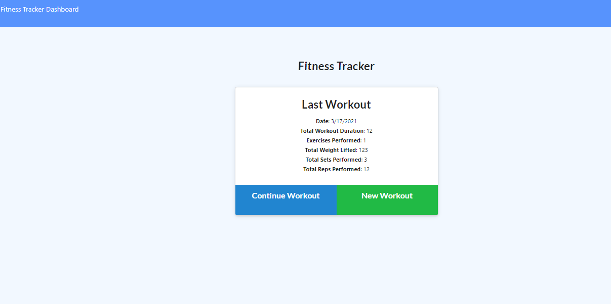
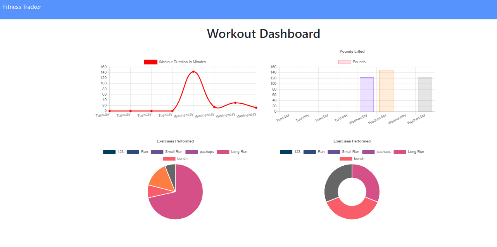

# Fitness-Tracker
Links:

Github: https://github.com/iliasc8/Fitness-Tracker.git 

Heroku: https://still-plains-92476.herokuapp.com/?id=6052bcc7a1b3db001575dec2 

## User Story

* As a user, I want to be able to view create and track daily workouts.

## Business Context

A consumer will reach their fitness goals more quickly when they track their workout progress.

## Acceptance Criteria

When the user loads the page, they should be given the option to create a new workout or continue with their last workout.

The user should be able to:

  * Add exercises to the most recent workout plan.

  * Add new exercises to a new workout plan.

